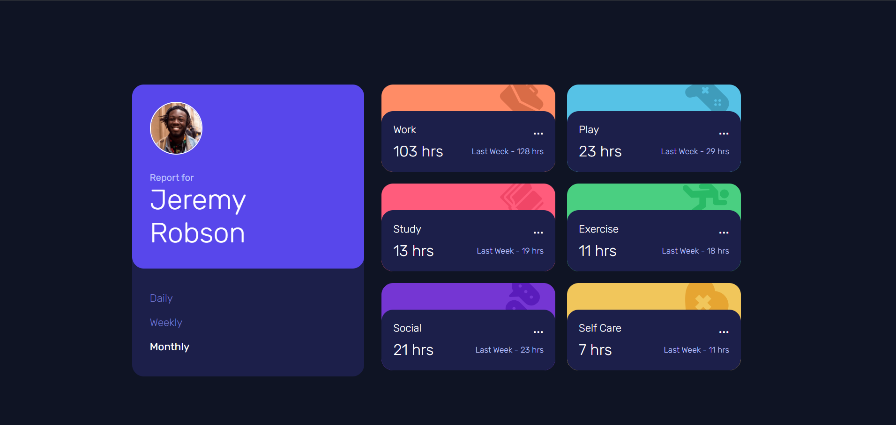
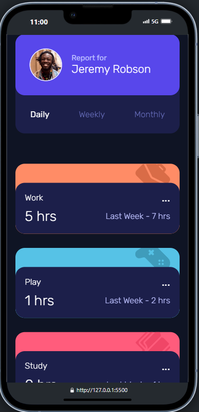

# Frontend Mentor - Time tracking dashboard solution

Ceci est une solution au [Time tracking dashboard challenge sur Frontend Mentor](https://www.frontendmentor.io/challenges/time-tracking-dashboard-UIQ7167Jw). Ces challenges visent à améliorer mes compétences en développement front-end. 

## Table of contents

- [Overview](#overview)
  - [The challenge](#the-challenge)
  - [Screenshot](#screenshot)
  - [Links](#links)
- [My process](#my-process)
  - [Built with](#built-with)
  - [What I learned](#what-i-learned)
- [Author](#author)

## Overview

### The challenge

Les utilisateurs doivent pouvoir

- visualiser la mise en page optimale du site en fonction de la taille de l'écran de leur appareil
- Voir les états de survol de tous les éléments interactifs de la page
- Passer de l'affichage des statistiques quotidiennes à celui des statistiques hebdomadaires ou mensuelles.

### Screenshot

### Links

- Repo URL: [https://github.com/HappyFeys/timeTracker](https://github.com/HappyFeys/timeTracker)

## My process

### Built with

- Semantic HTML5 markup
- SCSS custom properties
- Flexbox
- Mobile-first workflow
- JavaScript Vanilla

### What I learned

Dans ce projet, j'ai perfectionné mon positionnement d'éléments ainsi que la gestion du responsive.

## Author

- Github - [Dylan Feys](https://github.com/HappyFeys)
- LinkedIn - [Dylan Feys](https://www.linkedin.com/in/dylan-feys/)